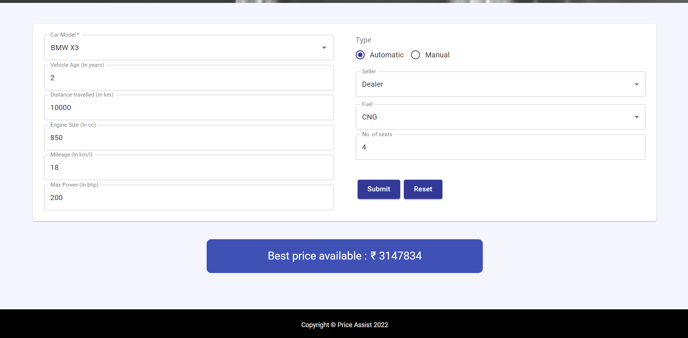

# Price Assist

  
  

<h4 align="center">Get the best price for your car</h4>

  

    <a href="https://price-assist-1e25a.web.app/">View Deployment</a>
    ·
    <a href="https://github.com/beastrun12j/Price-Assist/issues">Report Bug</a>
  

## About the app

- Price Assist helps the users to get the best price for their used old cars in a matter of minutes.
- Our app makes use of the various specifications of your car like mileage, brand, kilometers driven, etc. to predict its most optimal selling price.
- If someone is interested to buy a second-hand vehicle, they will know whether the price offered by the seller is overpriced or not.

## Design

- The app makes use of Material UI 5 for the beautiful UI components.
- All the icons are taken from [Icons8](https://icons8.com) under its free-tier subscription and [react-icons](https://www.npmjs.com/package/react-icons) package.

## About ReactJs

- React is a JavaScript-based UI development library. 
- Facebook and an open-source developer community run it. 
- Although React is a library rather than a language, it is widely used in web development. 
- The library first appeared in May 2013 and is now one of the most commonly used frontend libraries for web development.
- React offers various extensions for entire application architectural support, such as Flux and React Native, beyond mere UI.

## About Django

- Django is a high-level Python web framework that encourages rapid development and clean, pragmatic design.
- Django was designed to help developers take applications from concept to completion as quickly as possible.
- Django takes security seriously and helps developers avoid many common security mistakes.
- Some of the busiest sites on the web leverage Django’s ability to quickly and flexibly scale.

## About Sklearn

- Scikit-learn (Sklearn) is the most useful and robust library for machine learning in Python.
- It provides a selection of efficient tools for machine learning and statistical modeling including classification, regression, clustering and dimensionality reduction via a consistence interface in Python.
- This library is largely written in Python and is built upon NumPy, SciPy and Matplotlib.

## Libraries and tools 🛠

<li><a href="https://reactjs.org">React JS</a></li>
<li><a href="https://developer.mozilla.org/en-US/docs/Web/JavaScript">JavaScript ES6</a></li>
<li><a href="https://firebase.google.com">Firebase</a></li>
<li><a href="https://firebase.google.com">Heroku</a></li>
<li><a href="https://mui.com">Material UI 5</a></li>
<li><a href="https://axios-http.com/docs/intro">Axios</a></li>
<li><a href="https://formik.org/">Formik</a></li>
<li><a href="https://www.djangoproject.com/start/">Django</a></li>
<li><a href="https://www.python.org/">Python</a></li>
<li><a href="https://scikit-learn.org/stable/">Sklearn</a></li>
<li><a href="https://pandas.pydata.org/">Pandas</a></li>
<li><a href="https://numpy.org/">Numpy</a></li>

## Setup

- Fork and clone the repository locally.
- Navigate to the cloned folder

### Frontend

1. Download the latest version of [Node.js](https://nodejs.org/en/download/) for your OS
2. Run <code>npm install</code> 
3. Start the app <code>npm run</code>

### Backend

1. Create Python Venv and download all the dependencies using requirements.txt (present in /backend)
2. Run <code>python manage.py runserver</code> on windows and <code>python3 manage.py runserver</code>

## Contributing

Contributions are what make the open source community such an amazing place to learn, inspire, and create. Any contributions you make are **greatly appreciated**.

If you have a suggestion that would make this better, please fork the repo and create a pull request. You can also simply open an issue with the tag "enhancement" or "feature".
Don't forget to give the project a star!

1. Fork the Project
2. Create your Feature Branch (`git checkout -b feature/AmazingFeature`)
3. Commit your Changes (`git commit -m 'Add some AmazingFeature'`)
4. Push to the Branch (`git push origin feature/AmazingFeature`)
5. Open a Pull Request

## License

This application is released under MIT License for fair use (see [License](https://github.com/beastrun12j/Price-Assist/blob/master/LICENSE)).
